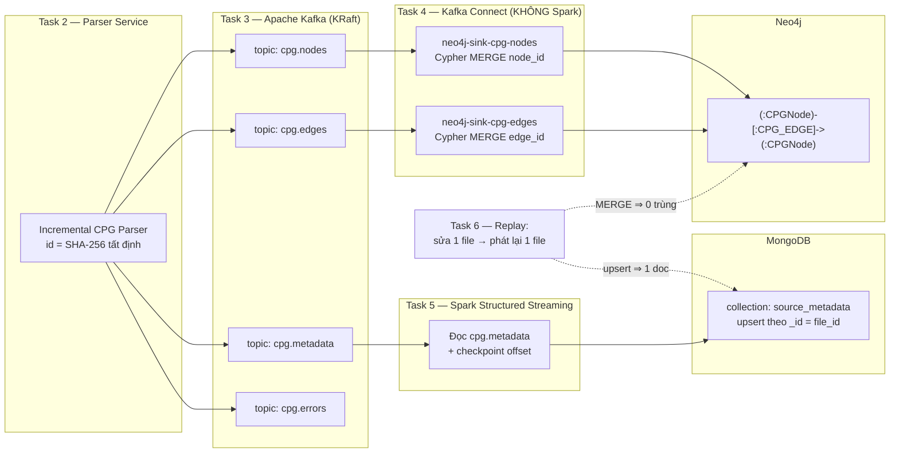

# Hướng dẫn Task 4 & Task 6 — Nạp đồ thị vào Neo4j và Kiểm chứng Idempotent

Tài liệu này giải thích **mình đã làm gì**, **cách chạy**, và **chứng minh từng
yêu cầu của đề bài đã được đáp ứng** cho hai phần:

- **Task 4 — Graph Topology Ingestion into Neo4j** (2 điểm)
- **Task 6 — Idempotent Replay Verification** (1 điểm)

Chi tiết từng phần nằm trong [task4/README.md](task4/README.md) và
[task6/README.md](task6/README.md). File này là bản tổng quan xâu chuỗi.

---

## 1. Bối cảnh: hai task này nằm ở đâu trong pipeline

Pipeline hoàn chỉnh gồm 6 bước. Trạng thái hiện tại của cả nhóm:

| Task | Nội dung | Trạng thái | Nơi chứa |
|------|----------|-----------|----------|
| 1 | Clone repo + liệt kê file Python | ✅ đã merge | `task1/` |
| 2 | Parser Service (AST/CFG/DFG/CALL, id SHA-256) | ✅ đã merge | `task2/` |
| 3 | Thiết kế topic Kafka + contract sự kiện | ✅ đã kéo về | `task3/` (từ branch `feature/task3-kafka-topic-design`) |
| **4** | **Nạp node/edge vào Neo4j (Kafka Connect)** | ✅ **mình làm** | `task4/` |
| 5 | Nạp metadata vào MongoDB (Spark) | ✅ đã kéo về | `task5/` (từ branch `task5-mongodb-streaming`) |
| **6** | **Kiểm chứng phát lại idempotent** | ✅ **mình làm** (Neo4j) + Task 5 lo phần MongoDB | `task6/` + `task5/verify_task6_mongodb.sh` |

Mình phụ trách **Task 4** (Kafka → Neo4j, không qua Spark) và **Task 6** (kiểm
chứng phát lại). Cả bốn task 3/4/5/6 giờ **dùng chung một Kafka broker duy nhất**
của Task 3 — Task 4 và Task 5 đều là *overlay* chồng lên `compose.yml`, nên một
luồng sự kiện từ Task 2 nuôi đồng thời cả hai sink (Neo4j + MongoDB).

---

## 2. Sơ đồ kiến trúc (Architecture Diagram — 1 điểm)



**Điểm mấu chốt:** node/edge đi **thẳng** từ Kafka vào Neo4j qua Kafka Connect,
**không có tầng Spark trung gian** — đúng yêu cầu mục 1.5 của đề. Spark chỉ dùng
cho nhánh metadata → MongoDB (Task 5).

---

## 3. Cách chạy nhanh (đầu-cuối, đã link Neo4j + MongoDB)

Yêu cầu: Docker Desktop, Python 3.10+. Chạy từ **thư mục gốc repo**.

```powershell
# 0) Cài thư viện Python
pip install -r task4/requirements.txt

# 1) Bật TOÀN BỘ pipeline trên MỘT Kafka chung:
#    compose.yml (Kafka Task 3) + overlay Task 4 (Neo4j) + overlay Task 5 (MongoDB)
docker compose -f compose.yml -f task4/docker-compose.yml -f task5/docker-compose.yml up -d

# 2) Tạo 4 topic Kafka (Task 3 sở hữu)
bash task3/create_topics.sh

# 3) Áp schema Neo4j + đăng ký 2 connector (từ trong task4/)
cd task4; powershell -File scripts/setup.ps1; cd ..

# 4) Đưa sự kiện CPG vào Kafka MỘT LẦN — cả Neo4j lẫn MongoDB cùng tiêu thụ
#    A. Parser gửi thẳng Kafka:
python task2/parser_service.py --manifest artifacts/task1/python_manifest.jsonl `
    --repo-dir .work/repos/datasets --kafka-bootstrap localhost:9092
#    B. Hoặc phát lại JSONL dump của Task 2 (gồm cả metadata cho Task 5):
python task4/publish_jsonl_to_kafka.py --bootstrap localhost:9092 --topics nodes,edges,metadata

# 5) Kiểm chứng Task 4 (Neo4j)
python task4/verify_neo4j.py                # kỳ vọng: IDEMPOTENCY CHECK: PASS

# 6) Kiểm chứng Task 6 (phát lại idempotent, kiểm cả 2 sink)
python task6/replay_single_file.py --file src/datasets/load.py               # Δ = 0
python task6/replay_single_file.py --file src/datasets/load.py --apply-edit  # Δ nhỏ, 0 trùng
python task6/verify_idempotency.py --file src/datasets/load.py               # Neo4j + MongoDB
```

> Nếu chỉ muốn chạy **riêng Task 4** (không cần MongoDB), bỏ `-f task5/docker-compose.yml`
> ở bước 1 và bỏ `metadata` ở bước 4B.

Mở Neo4j Browser tại http://localhost:7474 (user `neo4j`, mật khẩu `cpgpassword`),
và MongoDB tại `mongodb://localhost:27017` (db `cpg`, collection `source_metadata`)
để chụp màn hình cho Jupyter Book.

---

## 4. Chứng minh đáp ứng yêu cầu đề bài

### Task 4 — "Wire the Neo4j Kafka Connector Sink to the topics carrying node and edge events... without an intermediate Spark layer... idempotent"

| Yêu cầu trong đề | Đã đáp ứng bằng | Bằng chứng để nộp |
|------------------|-----------------|-------------------|
| Dùng **Neo4j Kafka Connector Sink** | Plugin chính chủ `neo4j/neo4j-kafka-connector:5.1.0`, cài trong [task4/docker-compose.yml](task4/docker-compose.yml) | `curl localhost:8083/connector-plugins` liệt kê `Neo4jConnector` |
| Nối sink vào **topic node và edge** | 2 connector [neo4j-sink-nodes.json](task4/connectors/neo4j-sink-nodes.json) (topic `cpg.nodes`) + [neo4j-sink-edges.json](task4/connectors/neo4j-sink-edges.json) (topic `cpg.edges`) | `curl localhost:8083/connectors?expand=status` → cả hai `RUNNING` |
| Ghi thẳng **không qua Spark** | Kafka → Kafka Connect → Neo4j; overlay compose không chứa service Spark nào | Sơ đồ mục 2; `task4/docker-compose.yml` chỉ có `neo4j` + `kafka-connect` |
| **Idempotent** (phát lại không tạo trùng) | Cypher `MERGE` theo `node_id`/`edge_id` + ràng buộc `node_id IS UNIQUE` ([init.cypher](task4/neo4j/init.cypher)) | `verify_neo4j.py` in `Duplicate node_ids: 0`, `IDEMPOTENCY CHECK: PASS` |

**Cypher idempotent** (trong file connector):
- Node: `MERGE (n:CPGNode {node_id: event.node_id}) SET ...`
- Edge: `MERGE (src) MERGE (dst) MERGE (src)-[r:CPG_EDGE {edge_id: event.edge_id}]->(dst) SET ...`
  — MERGE cả hai đầu để edge đến trước node vẫn nối được; MERGE quan hệ theo
  `edge_id` nên phát lại không nhân đôi.

### Task 6 — "Modify one file, reprocess, verify Neo4j counts update without duplicates, MongoDB has updated metadata doc, Spark checkpoint skips processed offsets"

| Yêu cầu trong đề | Đã đáp ứng bằng | Bằng chứng để nộp |
|------------------|-----------------|-------------------|
| **Sửa 1 file, xử lý lại đúng file đó** | [replay_single_file.py](task6/replay_single_file.py) dùng chế độ `--single-file` của Parser Service, có sao lưu/khôi phục | Log `[parse] Reprocessing single file` |
| Neo4j **cập nhật số node/edge, không trùng** | So sánh snapshot trước/sau + đếm trùng | `Δ ...` và `Duplicate node_ids/edge_ids: 0`; truy vấn #2, #3 trong [task6/verify_queries.cypher](task6/verify_queries.cypher) trả 0 dòng |
| MongoDB **có document metadata đã cập nhật** (1 doc) | Task 5 upsert `_id = file_id` (`replace` + `upsertDocument`); [verify_idempotency.py](task6/verify_idempotency.py) và `task5/verify_task6_mongodb.sh` kiểm tra | `docs with this file_id = 1`, `content_sha256` đổi sau khi sửa |
| Spark checkpoint **bỏ qua offset file không đổi** | Job Task 5 dùng `checkpointLocation`; `verify_task6_mongodb.sh` restart Spark và xác nhận offset không đổi | Log Spark `numInputRows`, offset trước = sau khi restart |

**Hai kịch bản kiểm chứng** (mạnh hơn yêu cầu tối thiểu):
- *File không đổi* → phát lại phải cho `Δ = 0` tuyệt đối (chứng minh MERGE là no-op).
- *File đã sửa* → chỉ phần đồ thị của file đó thay đổi, số trùng toàn cục vẫn `0`.

---

## 5. Điểm kỹ thuật quan trọng: hòa giải khác biệt tên field giữa Task 2 và Task 3

Khi rà soát mình phát hiện **contract của Task 3 chưa khớp 100% với output thực
tế của Task 2** (và cả consumer Task 5 cũng đang bám theo output thật của Task 2):

| Trường | Task 2 phát ra (thực tế trên wire) | Contract Task 3 (`TOPIC_CONTRACT.md`) |
|--------|-----------------------------------|---------------------------------------|
| Đầu/cuối của edge | `source_id` / `target_id` | `source_node_id` / `target_node_id` |
| `event_type` | `node` / `edge` / `metadata` | `NODE_UPSERT` / `EDGE_UPSERT` / ... |
| `edge_type` cho call | `CALLS` | `CALL` |
| `schema_version` | `"1.0.0"` (chuỗi) | `1` (số) |
| Vị trí node | `lineno` / `col_offset` | `line_start` / `column_start` |

Để Task 4 **không bị phụ thuộc** vào việc nhóm chọn thống nhất theo bên nào,
Cypher trong connector dùng `coalesce()` nhận **cả hai** kiểu tên, ví dụ:
`MERGE (src:CPGNode {node_id: coalesce(event.source_id, event.source_node_id)})`.
Nhờ vậy connector chạy đúng dù sự kiện đến từ Parser Service (Task 2) hay từ file
mẫu của Task 3. `schema_version` được ép `toString(...)` để nhận cả chuỗi lẫn số.

> **Khuyến nghị cho nhóm:** nên thống nhất Task 2 và Task 3 về một bộ tên field
> (đằng nào Task 5 cũng đã bám theo output thật của Task 2). Task 4 đã "chịu" được
> cả hai nên không phải điểm chặn, nhưng thống nhất sẽ sạch hơn khi báo cáo.

---

## 6. Ghi chú trung thực về phạm vi

1. **Task 3** đã kéo về working tree (`task3/` + `compose.yml` + `artifacts/task3/`).
   Task 4 và Task 5 dùng chung broker này, **không** dựng lại Kafka.

2. **Task 5** (MongoDB + Spark) cũng đã kéo về `task5/` (từ branch
   `task5-mongodb-streaming`). Có **hai cách** chạy Task 5:
   - **Linked (khuyến nghị):** overlay `task5/docker-compose.yml` — chồng lên
     Kafka của Task 3, dùng chung một broker với Task 4. Đây là cách để cả Neo4j
     và MongoDB cùng nhận một luồng sự kiện (xem lệnh 3 file compose ở mục 3).
   - **Standalone:** `docker-compose.task5.yml` (giữ nguyên từ branch) — tự dựng
     Kafka + MongoDB + Spark riêng ở cổng `29092`, dùng cho demo Task 5 tách biệt
     với script `task5/verify_task6_mongodb.sh`.
   - Ở Task 6, `verify_idempotency.py` của mình kiểm tra MongoDB (db `cpg`,
     collection `source_metadata`, khóa `_id`/`file_id`) và **tự bỏ qua** gọn gàng
     nếu MongoDB chưa chạy — nên phần Neo4j luôn chạy độc lập được.

3. **Không sửa code Task 2.** Parser Service có cờ `--dry-run` mặc định `True` nên
   khi truyền `--kafka-bootstrap` nó vẫn ghi JSONL. Để không đụng Task 2, Task 6
   cho parser ghi vào thư mục riêng `artifacts/task6/replay/` rồi dùng cầu nối
   `publish_jsonl_to_kafka.py` đẩy lên Kafka. Nếu muốn parser gửi thẳng Kafka, chỉ
   cần sửa một dòng cờ đó trong Task 2.

4. **Mật khẩu Neo4j** mặc định `neo4j / cpgpassword`, đồng nhất trong compose,
   connector và mọi script.

---

## 7. Bản đồ file mình đã tạo

```
task4/  (overlay — dùng chung Kafka của Task 3)
├── docker-compose.yml            # Neo4j + Kafka Connect (plugin Neo4j)
├── connectors/
│   ├── neo4j-sink-nodes.json     # sink cpg.nodes  → MERGE CPGNode
│   └── neo4j-sink-edges.json     # sink cpg.edges  → MERGE CPG_EDGE
├── neo4j/init.cypher             # ràng buộc uniqueness + index
├── scripts/
│   ├── setup.ps1                 # one-shot Windows: topic + schema + connector
│   └── register_connectors.sh    # đăng ký connector (POSIX)
├── publish_jsonl_to_kafka.py     # cầu nối JSONL (Task 2) → Kafka
├── verify_neo4j.py               # đếm + phát hiện trùng + kết luận
├── verify_queries.cypher         # truy vấn cho Neo4j Browser
├── requirements.txt
└── README.md

task6/
├── replay_single_file.py         # điều phối phát lại 1 file + so sánh trước/sau
├── verify_idempotency.py         # kiểm tra trùng Neo4j + MongoDB (tùy chọn)
├── verify_queries.cypher         # truy vấn kiểm chứng trước/sau
└── README.md

# Đã kéo về để link chung (không phải mình viết, chỉ thêm overlay linked):
task3/                            # thiết kế topic Kafka + contract (broker dùng chung)
compose.yml                       # Kafka của Task 3
task5/                            # Spark → MongoDB
├── docker-compose.yml            # (MỚI) overlay linked: MongoDB + Spark trên Kafka Task 3
├── metadata_stream.py            # job Spark Structured Streaming (nguyên bản Task 5)
├── verify_task6_mongodb.sh       # kiểm chứng MongoDB/checkpoint cho Task 6 (nguyên bản)
└── ...
docker-compose.task5.yml          # bản Task 5 self-contained (nguyên bản, để demo tách biệt)
```
