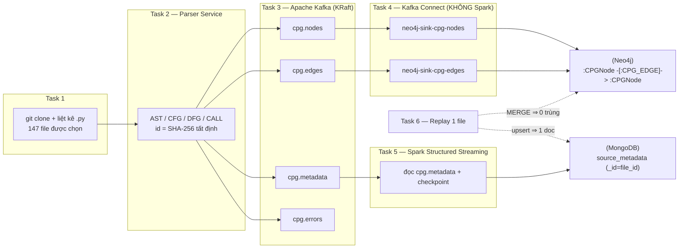

# huggingface-cpg-streaming — Big Data Lab 04

Pipeline **streaming** dựng **Code Property Graph (CPG) tăng dần** từ mã nguồn
Python của repo `huggingface/datasets`, rồi nạp song song vào **hai hệ CSDL**:

- **Neo4j** ← topology đồ thị (node + edge), qua Neo4j Kafka Connector Sink.
- **MongoDB** ← metadata mã nguồn, qua Spark Structured Streaming.

Toàn bộ đi qua **một Apache Kafka broker duy nhất**. Mọi phần tử mang **id
SHA-256 tất định** nên chạy lại (replay) không tạo bản trùng (idempotent).

> Tài liệu chuyên sâu cho Task 4 & Task 6: [HUONG_DAN_TASK4_TASK6.md](HUONG_DAN_TASK4_TASK6.md).

---

## 1. Kiến trúc tổng thể



| Task | Nội dung | Điểm | Thư mục |
|------|----------|:----:|---------|
| 1 | Repository Cloning & File Discovery | 1 | `task1/` |
| 2 | Incremental CPG Parser Service | 1.5 | `task2/` |
| 3 | Kafka Topic Design | 1.5 | `task3/` |
| 4 | Graph Topology Ingestion into Neo4j | 2 | `task4/` |
| 5 | Source Metadata Ingestion into MongoDB | 2 | `task5/` |
| 6 | Idempotent Replay Verification | 1 | `task6/` |
| — | Architecture Diagram | 1 | tài liệu này |

---

## 2. Yêu cầu môi trường

- **Docker Desktop** (có `docker compose`).
- **Python 3.10+**, cài client: `pip install -r task4/requirements.txt`
  (gồm `kafka-python`, `neo4j`, `pymongo`).
- Cổng trống trên host: `9092` (Kafka), `7474/7687` (Neo4j), `8083` (Connect),
  `27017` (MongoDB), `4040` (Spark UI).

Cổng & mật khẩu mặc định:

| Dịch vụ | Địa chỉ | Đăng nhập |
|---------|---------|-----------|
| Kafka (host) | `localhost:9092` | — |
| Neo4j Browser | http://localhost:7474 | `neo4j` / `cpgpassword` |
| Kafka Connect REST | http://localhost:8083 | — |
| MongoDB | `mongodb://localhost:27017` | — (db `cpg`) |
| Spark UI | http://localhost:4040 | — |

---

## 3. Chạy nhanh TOÀN BỘ pipeline (đầu-cuối)

Chạy từ **thư mục gốc repo**.

```powershell
# 0) Cài client Python
pip install -r task4/requirements.txt

# 1) Task 1 — clone repo + liệt kê file Python
python task1/discover_files.py            # tạo artifacts/task1/ + clone .work/repos/datasets

# 2) Bật hạ tầng: Kafka (T3) + Neo4j/Connect (T4) + MongoDB/Spark (T5) trên MỘT Kafka
docker compose -f compose.yml -f task4/docker-compose.yml -f task5/docker-compose.yml up -d

# 3) Task 3 — tạo 4 topic Kafka
bash task3/create_topics.sh

# 4) Task 4 — áp schema Neo4j + đăng ký 2 connector
cd task4; powershell -File scripts/setup.ps1; cd ..

# 5) Task 2 — parse toàn repo, gửi thẳng sự kiện vào Kafka (nuôi cả Neo4j + MongoDB)
python task2/parser_service.py --manifest artifacts/task1/python_manifest.jsonl `
    --repo-dir .work/repos/datasets --kafka-bootstrap localhost:9092

# 6) Kiểm chứng Task 4 (Neo4j) và Task 5 (MongoDB)
python task4/verify_neo4j.py
docker compose -f compose.yml -f task4/docker-compose.yml -f task5/docker-compose.yml `
    exec mongodb mongosh cpg --eval "db.source_metadata.countDocuments()"

# 7) Task 6 — phát lại idempotent
python task6/replay_single_file.py --file src/datasets/load.py               # Δ = 0
python task6/replay_single_file.py --file src/datasets/load.py --apply-edit  # Δ nhỏ, 0 trùng
python task6/verify_idempotency.py --file src/datasets/load.py               # Neo4j + MongoDB
```

Tắt: `docker compose -f compose.yml -f task4/docker-compose.yml -f task5/docker-compose.yml down`
(thêm `-v` để xóa luôn dữ liệu).

---

## 4. Hướng dẫn từng Task

### Task 1 — Repository Cloning & File Discovery (`task1/`)
Shallow-clone `huggingface/datasets` rồi liệt kê & lọc file `.py` (bỏ test/setup/
auto-generated). Kết quả: **233 file .py**, chọn **147 file**.
```bash
python task1/discover_files.py                 # mặc định clone vào .work/repos/datasets
python task1/discover_files.py --refresh       # clone lại từ đầu
```
Sản phẩm: `artifacts/task1/python_manifest.jsonl`, `summary.json`, ...

### Task 2 — Incremental CPG Parser Service (`task2/`)
Xử lý **từng file một** (bounded memory), trích AST node + CFG/DFG/CALL edge, gán
id SHA-256 tất định, phát sự kiện JSON. **~135k node, ~303k edge.**
```bash
# Gửi thẳng Kafka (dùng cho pipeline thật):
python task2/parser_service.py --manifest artifacts/task1/python_manifest.jsonl \
    --repo-dir .work/repos/datasets --kafka-bootstrap localhost:9092
# Hoặc dry-run ra JSONL trong artifacts/task2/:
python task2/parser_service.py --dry-run
```

### Task 3 — Kafka Topic Design (`task3/`)
Bốn topic: `cpg.nodes`, `cpg.edges` (compact) → Neo4j; `cpg.metadata` (compact) →
MongoDB; `cpg.errors` (delete, giữ 7 ngày). Contract đầy đủ trong
[task3/TOPIC_CONTRACT.md](task3/TOPIC_CONTRACT.md).
```bash
bash task3/create_topics.sh
bash task3/list_topics.sh
bash task3/describe_topics.sh
```

### Task 4 — Graph Topology Ingestion into Neo4j (`task4/`)
Neo4j Kafka Connector Sink ghi node/edge **thẳng từ Kafka vào Neo4j, không qua
Spark**. Idempotent bằng Cypher `MERGE` theo `node_id`/`edge_id`.
Chi tiết: [task4/README.md](task4/README.md).
```bash
cd task4 && powershell -File scripts/setup.ps1 && cd ..
python task4/verify_neo4j.py         # kỳ vọng: IDEMPOTENCY CHECK: PASS
```

### Task 5 — Source Metadata Ingestion into MongoDB (`task5/`)
Spark Structured Streaming đọc `cpg.metadata` → upsert vào `cpg.source_metadata`
(`_id = file_id`), dùng `checkpointLocation` để resume theo offset.
Chi tiết: [task5/README.md](task5/README.md).
```bash
# Linked (chung Kafka Task 3) — đã nằm trong lệnh compose 3 file ở mục 3.
# Standalone (Kafka riêng cổng 29092):
docker compose -f docker-compose.task5.yml up -d
```

### Task 6 — Idempotent Replay Verification (`task6/`)
Sửa 1 file → xử lý lại đúng file đó → xác nhận Neo4j/MongoDB cập nhật **không
trùng** và checkpoint Spark bỏ qua offset cũ. Chi tiết: [task6/README.md](task6/README.md).
```bash
python task6/replay_single_file.py --file src/datasets/load.py --apply-edit
python task6/verify_idempotency.py --file src/datasets/load.py
bash task5/verify_task6_mongodb.sh        # smoke test phía MongoDB/checkpoint
```

---

## 5. Vì sao toàn pipeline idempotent

| Tầng | Cơ chế |
|------|--------|
| Task 2 | `node_id`/`edge_id`/`file_id` = SHA-256 tất định — cùng nội dung, cùng id. |
| Task 3 | topic node/edge/metadata dùng `cleanup.policy=compact` theo key. |
| Task 4 | Cypher `MERGE` theo id + ràng buộc `node_id IS UNIQUE`. |
| Task 5 | Mongo upsert `_id=file_id` (`replace` + `upsertDocument`). |
| Task 6 | phát lại file cũ ⇒ no-op; file sửa ⇒ chỉ đổi phần của file đó. |

---

## 6. Lưu ý tích hợp (quan trọng khi vận hành nhóm)

- **Một Kafka duy nhất:** Task 4 và Task 5 là *overlay* chồng lên broker của Task 3
  (`compose.yml`, internal `kafka:19092`, host `localhost:9092`). Bản
  `docker-compose.task5.yml` là phiên bản Task 5 **self-contained** (Kafka riêng
  cổng 29092) chỉ để demo tách biệt.
- **Khác biệt tên field Task 2 ↔ Task 3:** contract Task 3 dùng
  `source_node_id`/`CALL`/`schema_version:1`, còn Task 2 thực tế phát
  `source_id`/`CALLS`/`"1.0.0"`. Connector Task 4 dùng `coalesce()` để nhận **cả
  hai**, nên chạy đúng bất kể nguồn sự kiện. (Nên thống nhất về sau cho sạch.)
- **Cờ `--dry-run` của Task 2** mặc định `True`; muốn gửi Kafka phải truyền
  `--kafka-bootstrap` và tránh dựa vào cờ này (xem README từng task).

---

## 7. Cấu trúc thư mục

```
.
├── compose.yml                       # Task 3 — Kafka broker dùng chung
├── docker-compose.task5.yml          # Task 5 — bản self-contained (tùy chọn)
├── README.md                         # ← tài liệu này
├── HUONG_DAN_TASK4_TASK6.md          # tài liệu chuyên sâu Task 4 & 6
├── task1/  discover_files.py         # clone + liệt kê file
├── task2/  parser_service.py ...     # CPG parser + Kafka producer
├── task3/  create_topics.sh, TOPIC_CONTRACT.md, schemas/, samples/
├── task4/  docker-compose.yml (overlay), connectors/, scripts/, verify_neo4j.py
├── task5/  docker-compose.yml (overlay), metadata_stream.py, verify_task6_mongodb.sh
├── task6/  replay_single_file.py, verify_idempotency.py, verify_queries.cypher
└── artifacts/                        # kết quả trung gian (task1/2/3)
```

---

## 8. Nộp bài

Theo đề: nộp **một URL Jupyter Book** trên GitHub Pages, mỗi chương ứng một task,
kèm output thật (số node/edge, mẫu message Kafka, kết quả truy vấn DB), screenshot
Neo4j Browser / MongoDB, và phần reflection. Toàn bộ mã nguồn nằm trong repo này.
```
