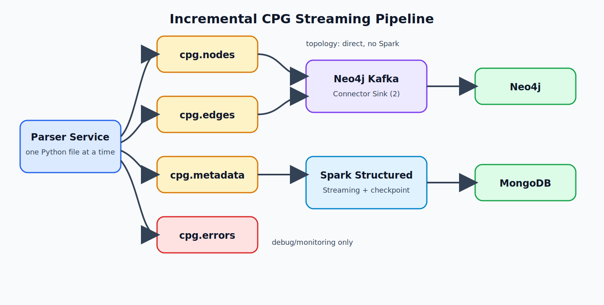

# Architecture Diagram

Parser là producer duy nhất và phát đúng bốn topic. Hai topic topology đi thẳng
vào Neo4j Kafka Connector Sink; chỉ topic metadata đi qua Spark. Parser error đi
riêng vào `cpg.errors`, không được trộn vào database sink.

## Trách nhiệm và idempotency

| Tầng | Khóa ổn định | Cách ghi |
|---|---|---|
| Parser | `file_id`, `node_id`, `edge_id` SHA-256 tất định | UPSERT và DELETE event |
| Kafka | record key tương ứng với ID | compact cho node/edge/metadata |
| Neo4j | `node_id`, `edge_id` | Cypher `MERGE`; DELETE dọn revision cũ |
| MongoDB | `_id = file_id` | replace/upsert trong `foreachBatch` |
| Spark | Kafka offsets | checkpoint trên named Docker volume |

Không có nhánh node/edge nào đi qua Spark.
